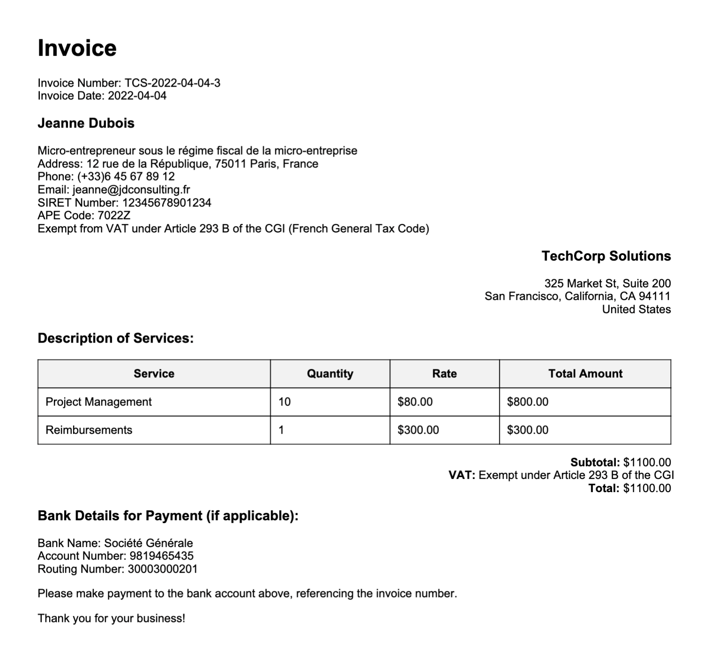

# 📝 Invoice Generator

This Python script allows you to create PDF invoices for your consulting services.

## 📚 Dependencies

- `yaml`
- `pdfkit`
- `jinja2`

## 📦 Installation

1. Clone the repository:

```bash
git clone https://github.com/narbonnais/invoice-generator.git
```

1. Install the dependencies:

```bash
pip install -r requirements.txt
```

3. Set up the config files in the `data/config` folder.

## 🚀 Usage

### Creating a new invoice

To create a new invoice, run the following command:

```bash
python3 invoices.py create_invoice <client_alias> "Service 1:rate:units" "Service 2:rate:units" -d <invoice_date>
```

For example:

```bash
python3 invoices.py create_invoice techcorp "Security audit:5000:1" "Reimbursements:300:1" -d 2021-01-01
```

The invoice will be generated in the `data/invoices` folder, and a new entry will be added to the history file in the `data/history` folder.

### Regenerating invoices

To regenerate all invoices based on the history file, run the following command:

```bash
python3 invoices.py regenerate
```

The existing invoices will be backed up in the `data/backup` folder and the new ones will be generated in the `data/invoices` folder.

### Resetting invoice number and deleting all invoices

To reset the invoice number and delete all invoices, run the following command:

```bash
python3 invoices.py reset
```

The existing invoices will be backed up in the `data/backup` folder.

### Computing total income for a given period

To compute the total income for a given period, run the following command:

```bash
python3 invoices.py compute_income -s <start_date> -e <end_date> -c <currency>
```

For example:

```bash
python3 invoices.py compute_income -s 2021-01-01 -e 2021-12-31 -c EUR
```

Both dates are optional. If no start date is provided, the script will use the `1970-01-01`. If no end date is provided, the script will use the current date.

Currency is optional. If no currency is provided, the script will use `USD` as default (the base currency for invoice). Note that the conversion is done on the invoice date.

### Summarizes activity per year and per quarter

To summarize activity per year and per quarter, run the following command:

```bash
python3 invoices.py summarize_history -c <currency>
```

The summary will be printed in the console:
    
```txt
Summary of the History:
------------------------------
2021:
  Q4: $2,415.60
  total: $2,415.60
2022:
  Q1: $4,798.25
  Q2: $5,750.90
  Q3: $6,172.10
  Q4: $6,882.50
  total: $23,603.75
2023:
  Q1: $7,299.35
  total: $7,299.35
------------------------------
```

Currency is optional. If no currency is provided, the script will use `USD` as default (the base currency for invoice). Note that the conversion is done on the invoice date.

## 📝 Sample invoice

The configuration files in the `data/config` and `data/history` folders are set up to generate invoices like the following one:

